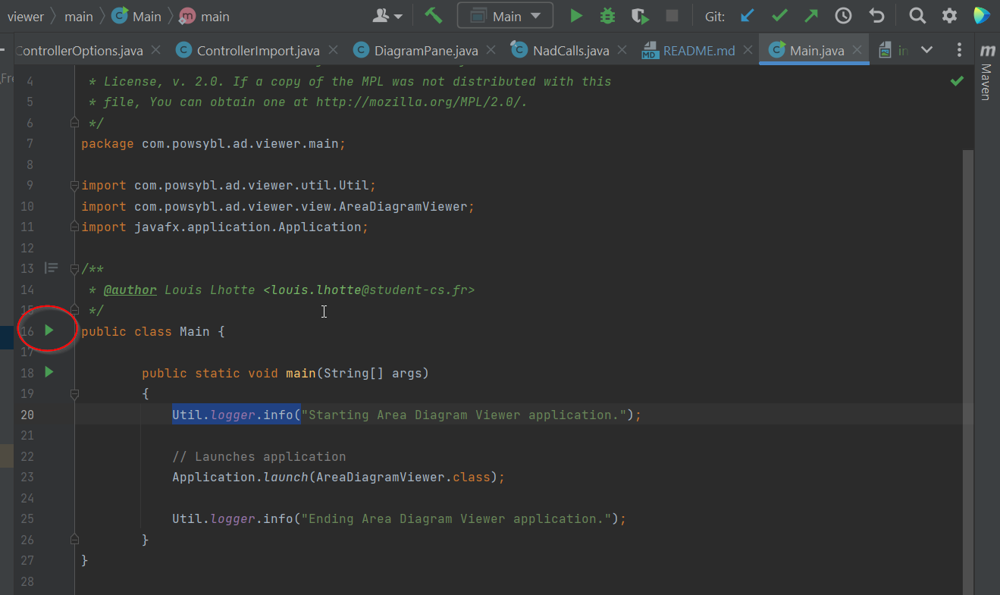
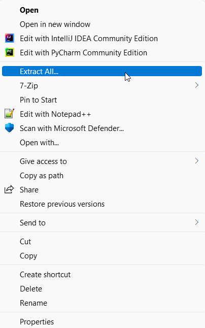
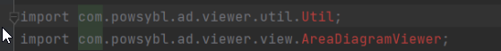

# Network-area-diagram-viewer

Most updated version of the area diagram viewer.

The area diagram viewer uses these three repositories which versions should be changed (in the pom.xml file) if different from the ones below:
```
powsybl.nad.version: 0.4.0-SNAPSHOT
powsybl.core.version: 4.7.0
```

### Launching with IntelliJ
`clean install` Network-area-diagram-viewer and go to `/src/main/java/com/powsybl/ad/viewer/main/Main.java` and click the green arrow (see below).


### Common problems encountered
- On Windows 11, do not use `Extract All` windows feature to extract the .zip of the other powsybl repositories. Despite allowing large file paths with the regestry editor, Windows 11 will not extract the zip file correctly (`Error 0x80010135`).



- When running `sh install.sh` to install `powsybl.core` if you encounter the following error:
```
[ERROR] some problems were encountered while processing the POMs:
[FATAL] Non-readable POM
...
The build could not read 1 project -> [Help 1]
```
Make sure there is no blanks in the path/to/install.sh. E.g. `my folder` should be replaced by `my_folder`.

- If one is using IntelliJ, those errors can appear after a successful maven `clean install`.


Restarting IntelliJ should be enough to solve the problem.